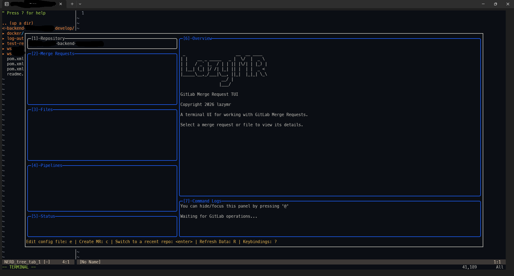
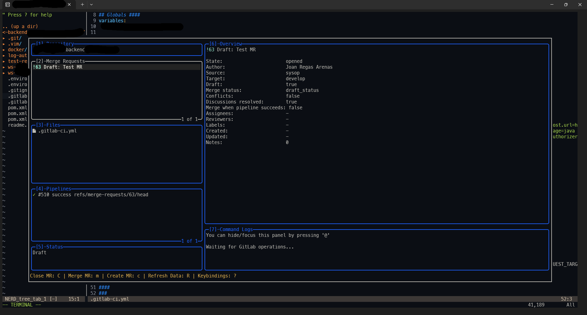
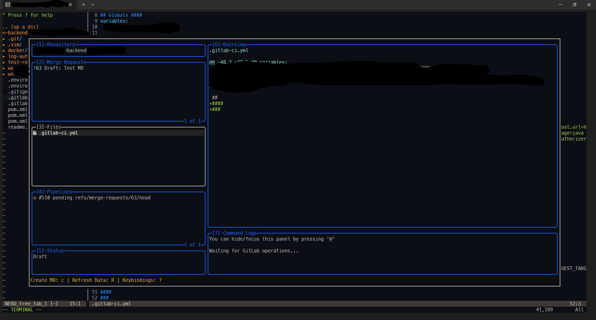
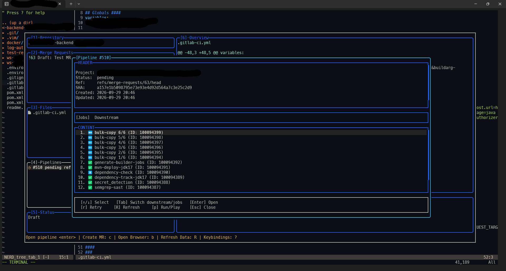
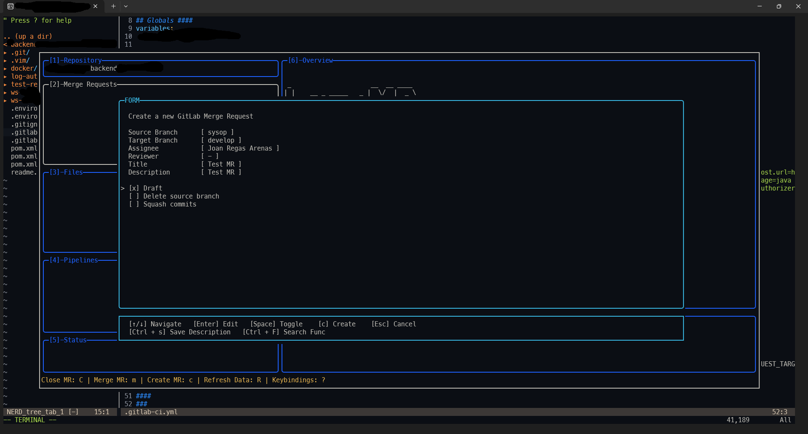
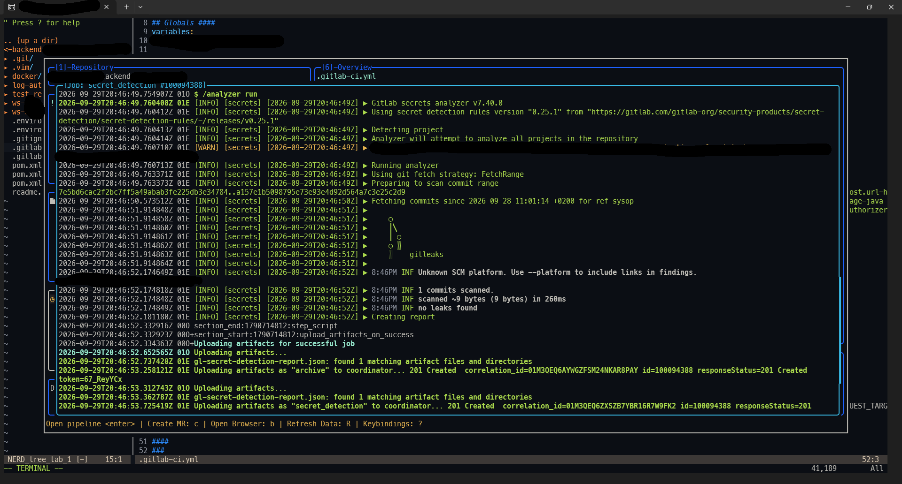

# Lazy MR

A terminal UI for working with GitLab Merge Requests.

Lazy MR provides a keyboard-driven interface for browsing, creating, reviewing, and managing GitLab Merge Requests directly from the terminal.

> **Status:** `v0.0.1-alpha`
>
> This is an early release. The main workflow is functional, but the project is still under active development.

## Features

* Browse GitLab Merge Requests
* Select and inspect Merge Requests
* Create Merge Requests
* Select source and target branches
* Assign reviewers and assignees
* Edit Merge Request title and description
* Mark Merge Requests as draft
* Delete source branches after merge
* Squash commits
* Browse changed files
* Browse files using a tree view
* View file diffs
* Browse pipelines
* Run pipelines
* Browse pipeline jobs
* View job logs
* View downstream pipelines
* Merge Merge Requests
* Close Merge Requests
* Command log
* Keyboard-driven navigation

## Screenshots

### Main window




### Merge Requests



### File Diff



### Pipelines



### Create Merge Request



### Job Logs




## Requirements

* Go `1.26.5` or newer
* Access to a GitLab instance
* A GitLab access token with the permissions required by the operations you want to perform

## Installation

Clone the repository and build the binary:

```bash
git clone <repository-url>
cd lazymr
make build
```

The resulting binary is:

```text
./lazymr
```

You can also run Lazy MR directly without building:

```bash
make run
```

## Configuration

Lazy MR uses GitLab authentication configuration from the user's local configuration.

The application first looks for:

```text
~/.config/glab-cli/config.yml
```

and falls back to:

```text
~/.config/lazymr/config.yml
```

The configured GitLab host and authentication token are used to communicate directly with the GitLab API.

Lazy MR does not use the `glab` command as an API wrapper.

## Usage

Run the application from inside a Git repository:

```bash
./lazymr
```

Lazy MR identifies the current repository and its GitLab project from the local Git configuration.

It supports standard Git remote URL formats and Git worktrees.

## Keyboard Navigation

Lazy MR is designed to be used primarily from the keyboard.

Common controls include:

| Key       | Action               |
| --------- | -------------------- |
| `↑` / `↓` | Navigate             |
| `Tab`     | Change focus         |
| `Enter`   | Select / edit        |
| `Esc`     | Close / cancel       |
| `Space`   | Toggle               |
| `c`       | Create Merge Request |
| `q`       | Quit                 |

Individual views and modals provide additional controls where applicable.

## Architecture

Lazy MR is written in Go and communicates directly with the GitLab API.

The main packages are:

```text
pkg/
├── git/
│   └── Local Git repository discovery
│
├── gitlab/
│   └── GitLab API models and operations
│
└── gui/
    └── Terminal UI
```

Git repository discovery is responsible for:

* Repository root detection
* Git worktrees
* `.git` handling
* Git configuration
* Git remotes
* `origin`
* Git remote URL parsing

The GitLab package is responsible for:

* Authentication
* GitLab projects
* Merge Requests
* Files and diffs
* Pipelines
* Pipeline jobs
* Downstream pipelines

The UI is built using a local fork of `gocui`.

## Development

Build:

```bash
make build
```

Run directly:

```bash
make run
```

Clean the generated binary:

```bash
make clean
```

Or use the Go toolchain directly:

```bash
go test ./...
go build .
```

## Project Status

Lazy MR is currently an alpha project.

The current release focuses on the core GitLab Merge Request workflow. The API and UI are expected to evolve as the project develops.

## Roadmap

Planned areas include:

* Improved Merge Request creation workflow
* More Merge Request metadata
* Improved search and filtering
* Additional pipeline interaction
* UI refinements
* Additional GitLab features

## License

Lazy MR is released under the MIT License.

See [LICENSE](LICENSE) for details.

